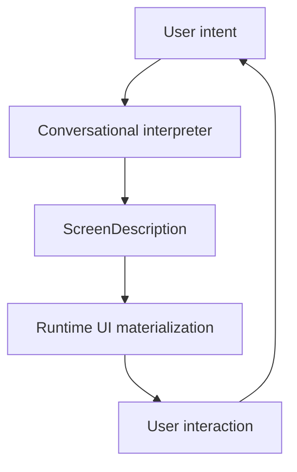
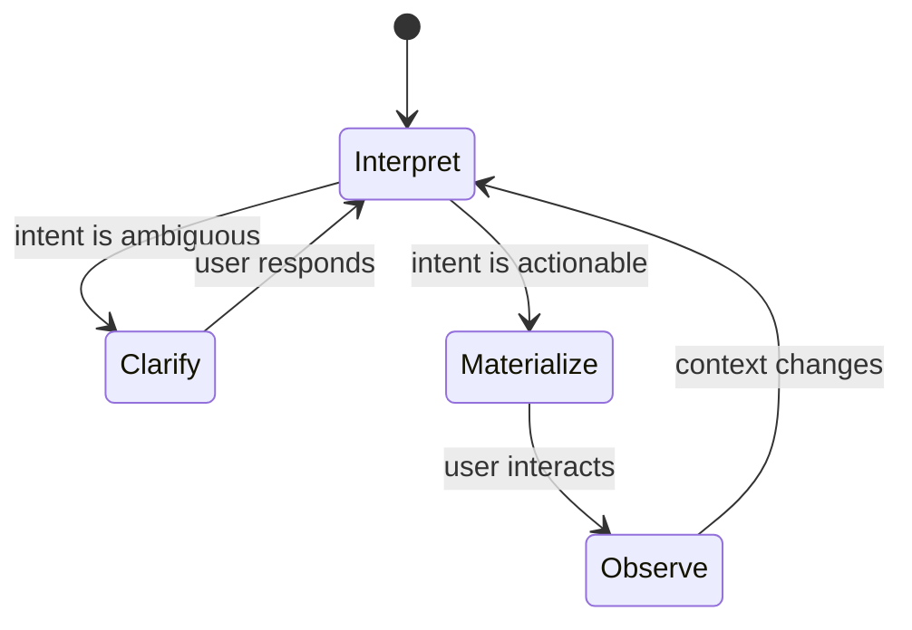
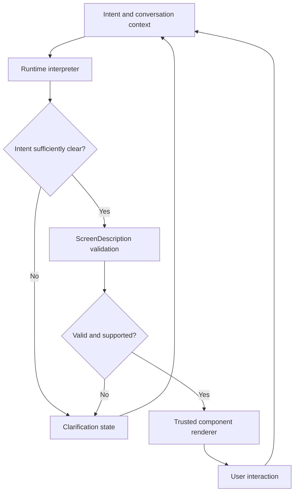

# Conversational Driven User Interface (CDUI) — Runtime Architecture

**Status:** Work in progress  
**Author:** Admir Sabanovic  
**Repository:** `conversational-portfolio`  
**Project:** CDUI Runtime Prototype  
**Licence:** Private intellectual property — not open source

---

## 🚀 What Is a Conversational Driven User Interface (CDUI)?

This project is an experimental implementation of a **Conversational Driven User Interface (CDUI)**: a conversation-powered UI runtime designed to replace traditional website navigation, rigid URL routing, and pre-rendered frontend layouts at the generated-interface layer.

Instead of manually clicking through menus, links, or predefined sitemaps, users explore the system by talking to it. The interface is generated at runtime from user intent and conversational context. In this prototype, a screen materializes because the user's current objective calls for it.

- **Zero navigation bars.**
- **Zero sitemaps.**
- **Zero static page layouts.**

The user interface emerges from the conversation itself.



Conversation is not merely an input field added to an otherwise conventional website. It is the control layer that helps determine **what interface should exist next**.

---

## 🔎 What “CDUI” Means in This Repository

Within this repository, **CDUI exclusively means _Conversational Driven User Interface_.**

The full name is used deliberately because the acronym `CDUI` has also been used independently for unrelated concepts, qualifications, tools, and projects.

### Not to Be Confused With

In this repository, CDUI does **not** mean:

- Config-Driven UI
- Component-Driven User Interface
- Concepteur Designer UI
- an unrelated `cdui` command, package, library, product, certification, or repository

Those uses are not associated with this project.

When referring to this architecture, use one of the following names:

- **Conversational Driven User Interface**
- **Conversational Driven User Interface (CDUI)**
- **CDUI Runtime**
- **Conversational UI Runtime**
- **Conversationally Generated UI**

The canonical project and architecture name is **Conversational Driven User Interface (CDUI)**.

---

## 🧠 Core Principles of CDUI

CDUI explores a UX paradigm in which the frontend layout is not fully predetermined. It is **constructed dynamically from interpreted user intent**.

### The Five Pillars of Conversational Driven User Interfaces

1. **Conversation replaces navigation**  
   The dialogue is the primary system driver rather than a secondary help feature.

2. **UI is data, not markup**  
   The layout engine operates on structured, serializable, and machine-validatable screen descriptions.

3. **AI describes; the runtime renders**  
   The intelligence layer proposes a target screen state. The local runtime validates it and materializes trusted components.

4. **Intent drives the layout**  
   User intent influences the arrangement, visibility, hierarchy, and composition of interface elements.

5. **Clarification replaces guessing**  
   When ambiguity would materially change the result, the runtime enters a clarification loop instead of inventing the user's objective.

### CDUI vs. Traditional Website UX

| Traditional website UX | CDUI Runtime architecture |
| :--- | :--- |
| User adapts to a predesigned layout | Interface adapts to the user's current objective |
| Static pages, fixed routes, and URL paths | Conversational screen states at the generated-interface layer |
| Navigation bars, headers, footers, and prebuilt layouts | Blank runtime canvas; the requested interface is materialized when needed |
| Predetermined menus and information hierarchies | Intent-driven component selection and composition |
| Designed interaction paths | Context-aware interaction that can mutate during the conversation |
| Invalid input usually produces validation or fallback states | Ambiguous intent can produce a purpose-built clarification interface |

---

## 🏗️ Why Even Bother? The Problem With Legacy UI

Web application navigation has barely changed at a structural level since the 1990s. Despite major advances in hardware, software, and machine learning, modern applications still commonly force humans to:

1. locate information manually across scattered views;
2. unravel complex, nested page hierarchies;
3. learn the vocabulary and information architecture chosen by the application designer; and
4. follow rigid paths mapped out before their specific objective was known.

That layout pattern is a historical design convention, not a natural law of computing.

Information systems should be able to adapt to humans — **not only require humans to adapt to them**.

A Conversational Driven User Interface can be:

- **summoned** when required;
- **shaped** by conversational and historical context;
- **negotiated** naturally through language;
- **clarified** when the objective is incomplete; and
- **mutated** as the user's objective changes.

The CDUI Runtime explores this transition:

$$
\text{Intent} \longrightarrow \text{Interpretation} \longrightarrow \text{Structured Screen} \longrightarrow \text{Interface}
$$

It treats the frontend as a living conversational state rather than a static destination.

---

## 🔬 Technical Paradigm Shift: CDUI vs. Config-Driven and Server-Driven UI

It is important to distinguish **Conversational Driven User Interface (CDUI)** from traditional **Config-Driven UI** and **Server-Driven UI (SDUI)** patterns.

All three approaches may represent interfaces through structured data. The decisive difference is **where the interface structure originates, when it is determined, and whether conversational intent can continuously change the screen topology at runtime**.

### Architectural Breakdown

```text
[ Config-Driven UI ]
Stored configuration -> Component renderer -> Configured view -> User interaction

[ Server-Driven UI ]
Server decision -> UI description -> Client renderer -> Server-selected view

[ Conversational Driven User Interface ]
User intent -> Runtime interpreter -> ScreenDescription -> Emergent interface
     ^                                                       |
     +---------------- continued interaction ----------------+
```

| Architecture | Structural source | Runtime behaviour | Primary adaptation |
| :--- | :--- | :--- | :--- |
| Conventional UI | Application source code | Selects among predefined screens and states | User follows designed navigation |
| Config-Driven UI | Stored configuration | Renders a configured arrangement of known components | Configuration changes the arrangement |
| Server-Driven UI | Server-provided representation | Renders a server-selected or server-composed view | Server changes the delivered structure |
| Conversational Driven UI | Interpreted conversational intent expressed through a constrained schema | Generates, revises, or clarifies the next interface state | Interface adapts to the user's current objective |

CDUI is not defined merely by using JSON, dynamic components, or an LLM. Its defining property is that **interpreted conversational intent participates in determining the next structured interface representation**.

### 1. Mutation Through Dialogue vs. Stored Configuration

**Config-Driven UI** renders views from configuration that already exists or was assembled through predetermined application logic. It may be flexible and remotely changeable, but its configuration usually describes known views, variants, or component arrangements.

**CDUI Runtime** treats the current screen description as session-dependent and revisable. The model can be generated or mutated in response to dialogue, corrections, new constraints, and interaction outcomes. The exact screen does not need to exist before the request that causes it to materialize.

### 2. Intent-Derived Topology vs. Predetermined Navigation

**Conventional, config-driven, and many server-driven systems** select from predefined routes, workflows, templates, or state transitions. Their contents may be highly dynamic even when their navigational topology is designed in advance.

**CDUI Runtime** derives the generated screen hierarchy from the user's current objective. The `ScreenDescription` represents the interface the runtime considers appropriate now; it does not have to map one-to-one to a predefined page.

This prototype therefore explores a **routeless model at the generated-interface layer**. The host application and infrastructure may still use an entry URL or technical routes. The claim is that the user-facing screen topology is not primarily defined by a conventional route table.

### 3. Native Intent-Clarification Loops

**Traditional systems** usually handle incomplete input through validation messages, fallback screens, empty states, or predefined help flows.

**CDUI Runtime** treats clarification as a core engine operation. If the available context is insufficient to create a reliable interface, the runtime can render a focused clarification state instead of guessing or displaying an unrelated generic screen.

The user's response then becomes part of the next interpretation cycle.

### 4. Continuous Alignment vs. One-Time Generation

CDUI is not limited to converting one prompt into one static screen.



The runtime can reconsider the interface after an action, correction, new constraint, or change of objective. Interface generation becomes an ongoing alignment process rather than a single design-time event.

---

## ⚙️ Core Runtime Architecture

The architecture separates probabilistic intent interpretation from deterministic application rendering.



### `ScreenDescription`

A structured, machine-validatable description of the current interface. It defines the screen hierarchy, content, widgets, actions, and relevant metadata without asking the AI to generate arbitrary executable frontend code.

### `Widget`

A supported visual or interactive primitive that the renderer knows how to materialize. Widgets may include text blocks, project cards, forms, timelines, lists, metrics, comparisons, selectors, and other components deliberately registered by the runtime.

### `Action`

A structured operation exposed through the generated interface. Actions connect rendered controls to behaviour governed by the host runtime.

### Conceptual Schema

```ts
type ScreenDescription = {
  id: string;
  title?: string;
  widgets: Widget[];
  actions?: Action[];
  context?: Record<string, unknown>;
};

type Widget = {
  id: string;
  type: string;
  props: Record<string, unknown>;
  children?: Widget[];
};

type Action = {
  id: string;
  type: string;
  label?: string;
  payload?: Record<string, unknown>;
};
```

> This is a conceptual illustration. The TypeScript definitions and validation rules in the source code are authoritative for the implementation.

### Runtime Sequence

1. **Receive intent** — The user expresses an objective or interacts with the current interface.
2. **Assemble context** — The runtime collects relevant conversation state, portfolio data, supported capabilities, and prior interaction results.
3. **Interpret** — The intelligence layer determines whether the request is actionable or ambiguous.
4. **Describe** — It returns a constrained `ScreenDescription` or clarification state.
5. **Validate** — The runtime checks the description against its schema and registered capabilities.
6. **Render** — Approved widgets and actions are mapped to trusted React components.
7. **Continue** — The resulting interaction updates context and starts the next cycle.

---

## 💬 What Makes This More Than an AI Chat Wrapper?

A chatbot displayed beside a conventional website is not a CDUI merely because it can answer questions.

Likewise, producing HTML or a dashboard from one prompt is not sufficient. The CDUI architecture combines:

- conversational intent as an input to interface structure;
- a formal intermediate screen representation;
- schema validation before rendering;
- a runtime of bounded, trusted components;
- structured actions rather than presentation alone;
- clarification as part of the interaction protocol;
- continued mutation across conversation cycles; and
- screen topology that does not need to correspond to a predefined page.

The `ScreenDescription` forms the boundary between probabilistic AI interpretation and deterministic application rendering.

---

## 🧪 Example Interaction

A visitor asks:

> Show me Admir's strongest projects involving AI and industrial systems, then compare the technologies used.

Instead of redirecting the visitor through a project archive, skills page, filters, and multiple detail routes, the CDUI Runtime can:

1. interpret the visitor's comparison objective;
2. identify the relevant portfolio data;
3. generate a comparison-oriented `ScreenDescription`;
4. render matching project cards, technology relationships, and relevant actions; and
5. reshape the interface when the visitor asks to focus on machine learning, industrial integration, or project outcomes.

The data is dynamic, but so is the **form of the interface presenting it**.

---

## 🛡️ Runtime Boundaries

Generative interpretation does not grant unrestricted execution authority. The intended architecture maintains the following boundaries:

- generated screen descriptions are validated against a strict schema;
- only registered widget and action types can be materialized;
- interface generation is separated from privileged action execution;
- action payloads are independently validated at the execution boundary;
- invalid or unsupported descriptions produce controlled fallback or clarification states;
- the model does not generate arbitrary React code for direct execution; and
- structured state can be inspected to understand what was rendered and why.

These boundaries are part of the CDUI design, not optional additions around it.

---

## 📌 Current Roadmap — MVP

- [x] React + TypeScript application scaffold
- [ ] Custom CDUI screen schema specification (`ScreenDescription`, `Widget`, `Action`)
- [ ] Layout engine and renderer for materializing screens from structured data
- [ ] Integrated chat panel with message-memory retention
- [ ] Screen-state history traversal with universal home and back actions
- [ ] Automated clarification loops for ambiguous user intent
- [ ] Contextual portfolio dataset covering projects, technology, and experience
- [ ] Polished example flows demonstrating the complete CDUI paradigm
- [ ] Runtime schema validation and deterministic fallback behaviour
- [ ] Direct LLM integration behind the structured interpreter boundary

---

## 🛠️ Planned Technology Stack

- **Core framework:** React + TypeScript with strict type safety
- **Build system:** Vite
- **Runtime:** Custom proprietary CDUI engine
- **Interface contract:** Structured `ScreenDescription`, `Widget`, and `Action` schemas
- **Renderer:** Trusted React component registry
- **Intelligence layer:** Mock schema responses transitioning to direct LLM integration

### Future Scope

- native voice input and audio output;
- animated UI avatar expressing conversational states;
- desktop wrappers through Electron or Tauri;
- dynamic timelines and interactive skill matrices;
- relationship and project-dependency graphs;
- richer multimodal input; and
- reusable CDUI capability modules beyond the portfolio prototype.

---

## ⚠️ Intellectual Property and Licence Notice

Copyright © 2026 Admir Sabanovic. All rights reserved.

The CDUI Runtime source code, implementation, project-specific schemas, documentation, and associated original materials in this repository are proprietary works belonging to Admir Sabanovic.

This project is:

- **private intellectual property**;
- **not open source**; and
- **not licensed for copying, modification, redistribution, commercial use, or the creation of derivative works**.

The repository may be made available for peer evaluation, technical review, and inspiration. Access to the repository does not grant an open-source licence, permission to reuse the implementation, or a transfer of intellectual-property rights.

No part of the source code or other copyright-protected repository material may be copied, modified, redistributed, sublicensed, sold, or incorporated into another work without prior explicit written permission from the author, except where applicable law independently permits otherwise.

This README documents the project's authorship, terminology, architecture, and development timeline. It is not itself a patent, trademark registration, or substitute for any formal intellectual-property registration.

---

## 👁️ Final Note

This is not a conventional website.

It is a working prototype of a **post-navigation interface** — a space where user-facing screens no longer depend on navigation bars, fixed page hierarchies, or predesigned paths.

The project challenges the assumption that users must first learn how to navigate software before they can achieve an objective. Instead, it explores how software can construct the required interface around an evolving human conversation.

> What if the interface were not merely the place where the conversation happened, but one of the things the conversation continuously created?

**CDUI is an experiment in interfaces that shape themselves around human intent.**

---

## Author

**Admir Sabanovic**  
GitHub: [@AdmireSwe](https://github.com/AdmireSwe)

For licensing or evaluation enquiries, contact the author through the repository's published contact channel.
